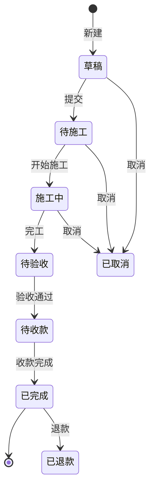
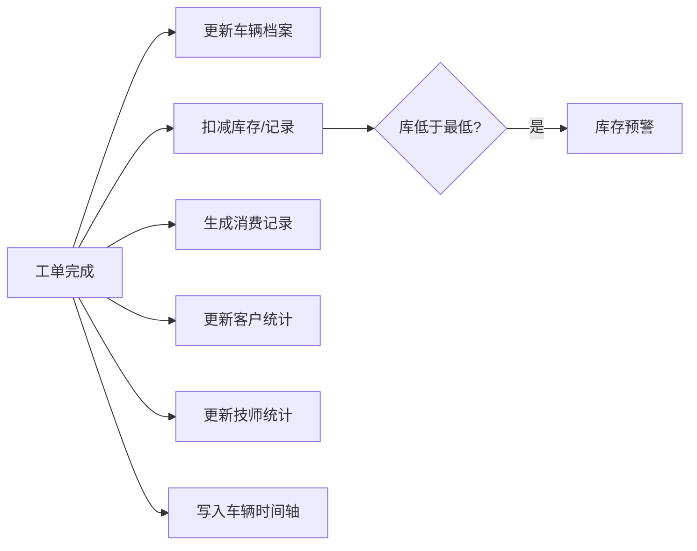
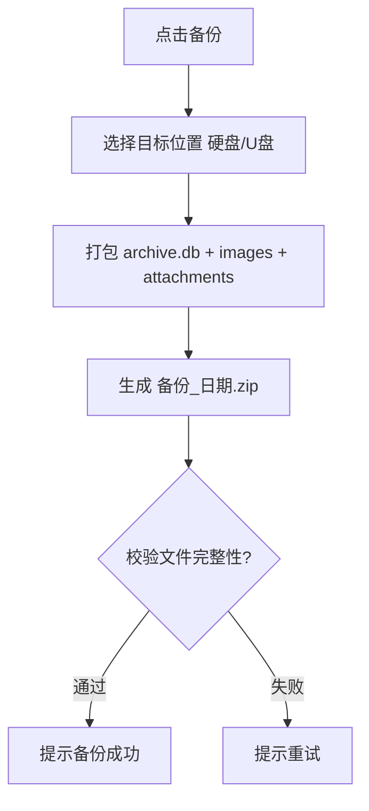

# 本地汽修档案管理系统（Local Automotive Archive System）

**文档版本**：v1.0（由服务器版改版）
**改版日期**：2026-09-08
**文档状态**：改端需求稿
**目标读者**：开发团队、实际使用者

---

## 改版说明（最重要）

原系统是**多用户 / 多角色 / 前后端分离 / 依赖 PostgreSQL 与 JWT** 的服务器端系统，适合门店多人同时操作。

本次改版目标：
- **从服务器端 → 本地单机桌面应用**
- **从关系型数据库服务器 → 本地 SQLite 单文件库**
- **从"角色权限" → 单一管理员**（去掉 Rbac/登录/角色/权限矩阵）
- **数据可移植**：整个应用数据装进**一个自包含文件夹**，放到硬盘/ U 盘即可带走、可备份、可恢复

**一句话定位**：一个人（或店主本人）在自己电脑上用的、数据整包可拷走的汽修档案管理工具。

---

## 一、项目概述

### 1.1 应用形态

- **桌面客户端应用**，双击图标直接打开，无需服务器、无需数据库服务进程、无需联网。
- 数据全部保存在**一个用户指定（或默认）的"数据目录"**内。
- 数据目录可放在本地硬盘、移动硬盘、U 盘、NAS 任意位置。**整个数据目录 = 整套数据**。

### 1.2 核心设计理念

1. **数据即文件夹**：所有业务数据 + 图片放在一个目录里，拷贝这个目录就是完整备份。
2. **车辆档案为核心**：打开一辆车 30 秒了解全部历史（时间轴）。
3. **工单驱动**：一次录入，自动更新车辆档案、消费统计、库存、图片归属。
4. **单管理员**：不做复杂权限，最多一个可选的开机密码锁。
5. **离线零依赖**：完全本地运行，不依赖网络与第三方服务。
6. **快照优先**：工单/配件中的名称、单价等历史记录做快照，改配置不影响历史。

### 1.3 目标用户

| 用户 | 需求 |
|------|------|
| 店主 / 个人 | 记录客户与车辆档案，查历史，看经营数据，数据能拷走 |
| 技师（可选） | 在工单里记录施工、拍照（同一台电脑或同一份数据目录） |

---

## 二、技术选型

| 层 | 选型 | 说明 |
|----|------|------|
| 桌面壳 | **Tauri 2.x**（备选 Electron） | 体积小、内存省、原生体验。前端沿用 React 知识 |
| 前端 | React + TypeScript + Vite + Ant Design | 与旧版一致，上手快 |
| 本地数据库 | **SQLite（单文件 archive.db）** | 通过 tauri-plugin-sql 在 Rust 侧访问，或采用 Node/better-sqlite3（Electron） |
| 图片/附件 | 文件系统（images/ 目录） | 数据库只存相对路径与元数据 |
| 备份 | 打包"数据目录"为 zip / 拷贝文件夹 | 一键备份到硬盘/U盘，一键恢复 |
| 打印/导出 | PDF 渲染 + CSV/Excel 导出 | 本地生成，无云服务 |

> 选 Tauri 还是 Electron：Tauri 更轻；若团队更熟 Node 原生库（better-sqlite3）则 Electron 更快上手。文档按 Tauri 描述，二者功能等价。

---

## 三、数据目录结构与备份（核心改动）

### 3.1 数据目录结构

```
<数据目录>/                 ← 可放任何位置（硬盘/U盘/NAS）
│
├── archive.db             ← SQLite 单文件：所有业务数据（客户/车辆/工单/库存等）
├── config.json            ← 应用设置（店铺名、默认路径、保养周期等，可选）
│
├── images/                ← 图片，按工单/车辆归档
│   ├── WO20260723001/     ← 按工单号分文件夹
│   │   ├── 01_施工前.jpg
│   │   ├── 02_施工中.jpg
│   │   └── thumbnails/    ← 缩略图
│   └── other/             ← 未关联工单的车辆照片
│
└── attachments/           ← 其他附件（合同、PDF、视频等，预留）
```

- 数据库内**图片只存相对路径**（如 `images/WO20260723001/01_施工前.jpg`），保证目录整体可搬。
- 图片上传时自动生成缩略图 + 清理 EXIF（可选），控制体积。

### 3.2 备份（一键）

- 点击"备份" → 选择目标位置（U盘/移动硬盘/文件夹）→ 生成 `归档系统备份_YYYYMMDD.zip`。
- 备份内容 = `archive.db` + `images/` + `attachments/` + `config.json`。
- 支持**计划提醒**：可设置每隔 N 天提醒备份。

### 3.3 恢复

- 选择"恢复" → 选一个备份 zip → 指定/确认新的数据目录 → 解压还原。
- 也可直接：把备份解压后的整个数据目录复制到任意电脑，用应用"打开数据目录"即可使用（数据迁移 = 拷文件夹）。

---

## 四、功能模块（精简保完整）

> 说明：保留"较完整业务"，但去掉多角色权限、云端通知、微信/小程序、AI、联机多店等。

### 4.1 主界面 / 仪表盘

- 今日/本月工单数、营收、收款情况。
- 库存预警列表。
- 即将到期的保养/保险/年检提醒。
- 最近工单与待办。

### 4.2 客户管理

- 客户 CRUD、搜索（手机号/姓名/车牌/VIN）。
- 自动汇总：车辆数、累计消费、到店次数、最近到店、客户等级。
- 客户等级规则（保留）：
  | 等级 | 判定 | 权益（备注用） |
  |------|------|----------------|
  | 普通 | <5,000 | - |
  | 银卡 | 5,000–20,000 | 工时 9 折 |
  | 金卡 | 20,000–50,000 | 工时 8 折 |
  | 钻石 | ≥50,000 | 工时 7 折 |

### 4.3 车辆管理 + 车辆档案（核心）

- 车辆 CRUD、搜索（车牌/VIN/车主/品牌/年份）。
- 车辆档案以**时间轴**呈现，每辆车一个页面：基础信息 + 保养/维修/改装记录 + 图片库 + 待办（保养、保险、年检）+ 消费统计。
- 自动计算：下次保养日期/公里数、累计工单、累计消费、最近到店。

### 4.4 工单系统（核心，数据引擎）

- 状态机（精简为）：**草稿 → 待施工 → 施工中 → 待验收 → 待收款 → 已完成**；特殊：**已取消 / 已退款**。
- 工单类型：保养 / 维修 / 改装 / 检查。
- 工单结构：工单主表 + 施工项目（工时费）+ 使用配件（数量×单价快照）+ 施工照片 + 费用汇总。
- 工单完成自动联动：
  1. 更新车辆档案（公里数、保养日期、提醒）
  2. 扣减库存、生成出库流水
  3. 生成消费/收款记录
  4. 更新客户/车辆/店面统计
  5. 写入车辆时间轴

- **保养/维修/改装记录**：作为"工单类型 + 类型专属字段"实现，通过工单筛选得到对应记录视图（避免冗余建 4 套表）。
  - 保养：机油品牌/型号/加注量，下次保养提醒。
  - 维修：故障描述、故障码（内置常见 OBD 码库提示）、诊断、方案、结果。
  - 改装：品牌/型号/序列号/安装·拆除日期/状态（已安装/已拆除/已更换）。

### 4.5 图片管理

- 随工单/车辆上传，可多选、批量；自动缩略图。
- 分类：施工前/中/后/故障；部位：发动机/底盘/悬挂/刹车/轮胎/内饰/外观/电气/其他；标签。
- 图片中心：按时间轴/网格浏览、搜索（车牌/客户/备注）。

### 4.6 库存（简单版）

- 配件 CRUD：编号、名称、分类、品牌/型号/规格、单位、进货价、销售价、当前库存、最低库存、存放位置。
- 入库 / 出库 / 盘点调整，全部记**库存流水**。
- 工单用配件自动出库；低于最低库存自动预警。
- 供应商简单管理（可选）。

### 4.7 消费 / 收款

- 收款：材料费 + 工时费 − 优惠 = 应收；实收；付款方式（现金/微信/支付宝/银行卡/转账/挂账）。
- 退款（店长/管理员确认）。消费记录汇总。

### 4.8 报表

- 营业额报表（日/周/月/年）、客户分析、车型统计、保养项目统计、技师绩效（可选）、库存报表。
- 导出 Excel / CSV / PDF。

### 4.9 打印 / PDF

- 工单、结算单、小票（A4 与 58mm/80mm）。
- 浏览器打印 / 本地生成 PDF。

### 4.10 安全（本地简化版）

- 可选**开机进入密码**（应用级，管理数据目录即可绕过，不做强安全；用于防随手误开）。
- 数据库用 SQLite（可选加密 SQLCipher，密码即目录密码，加密后备份文件也加密，但需牢记密码）。
- 不做角色/菜单/按钮/数据权限矩阵。

---

## 五、数据模型（SQLite 表设计）

> 加 * 表示快照字段（历史记录用，不随主表修改而变化）。索引按查询场景建立：车牌/手机号/VIN 唯一索引，外键索引。

| 表 | 说明 | 关键字段 |
|----|------|----------|
| customers | 客户 | name, phone(唯一), wechat, gender, birthday, address, tags, source, note, avatar_path |
| vehicles | 车辆 | plate_number(唯一), brand, model, year, color, vin(唯一), engine, transmission, displacement, drive_type |
| | | current_mileage, last_maintenance_date/km, insurance_expire, inspection_expire, customer_id(FK) |
| work_orders | 工单主表 | order_no(唯一), type, status, customer_id, vehicle_id, shop_time, due_time, receptionist, technicians |
| | | to_shop_mileage, fault_desc, note, priority, customer_name*, customer_phone*, vehicle_plate*, vehicle_info* |
| work_order_items | 施工项目 | order_id, name, type, desc, labor_fee, discount, actual_fee, technician_id, status, sort |
| work_order_parts | 使用配件 | order_id, item_id, part_id, part_name*, qty, unit_price*, discount, actual_fee |
| parts | 配件/商品 | part_no(唯一), name, category, brand, model, spec, unit, purchase_price, sale_price, stock, min_stock, location, supplier_id |
| stock_transactions | 库存流水 | part_id, type(入库/出库/盘点/退货/报损), qty(±), before_stock, after_stock, ref_no, operator_id, created_at, note |
| images | 图片 | vehicle_id, order_id, item_id, rel_path, thumb_path, stage, part, tags, note, taken_at, uploader |
| maintenance_details | 保养专属 | order_id, oil_brand, oil_model, oil_qty, next_maintenance_at, next_maintenance_km |
| repair_details | 维修专属 | order_id, fault_code, diagnosis, plan, result, result_note |
| modification_details | 改装专属 | order_id, proj_name, brand, model, serial, install_date, remove_date, status |
| appointments | 预约（精简） | customer_id, vehicle_id, date, time, duration, service_type, note, status |
| suppliers | 供应商（可选） | name, contact, phone, address, last_term, note |
| settings | 设置 | key, value（店铺名、保养周期、提醒提前量等） |
| operators | 操作人（可选） | name, role(店主/技师/前台) —— 仅用于"记录是谁干的"，无权限 |

> 备注：原 PRD 中的 roles / permissions / role_permissions / user_roles / users / JWT 全部移除；操作人仅作为记录归属，非权限体系。

---

## 六、关键业务流程（Mermaid）

### 6.1 工单状态流转



### 6.2 工单完成自动联动



### 6.3 备份流程



---

## 七、分阶段实施

### 第一阶段（核心闭环，先能用）
- 数据目录 + SQLite 建库 + 整体备份/恢复。
- 客户、车辆、车辆档案（时间轴）。
- 工单：创建、施工项目、配件、照片、完成联动。
- 图片上传 + 缩略图。
- 收款 + 消费记录。

### 第二阶段（增强）
- 保养/维修/改装类型专属字段与提醒。
- 库存流水 + 预警。
- 报表 + Excel/CSV 导出 + PDF 打印。
- 预约（精简）、供应商。

### 第三阶段（体验/扩展，可选）
- 开机密码 / SQLCipher 加密。
- 计划备份提醒。
- 图片 AI 辅助识别（本地模型，可选）、导出整库为 JSON 作为开放归档格式。

---

## 八、与原系统差异对照

| 维度 | 原服务器版 | 本地方案 |
|------|-----------|----------|
| 运行形态 | 服务器 + Web 前端 | 桌面客户端（Tauri/Electron） |
| 数据库 | PostgreSQL（服务） | SQLite 单文件 |
| 登录/权限 | JWT + RBAC + 角色权限矩阵 | 无或仅开机密码 |
| 部署 | Docker + Nginx + 容器 | 双击即用 |
| 备份 | 服务器备份/云端 | 整个数据目录拷贝/U盘 |
| 图片存储 | 本地存储/MinIO | images/ 相对路径文件夹 |
| 通知 | 微信/短信 | 本地提醒横幅 |
| 多店/微信/小程序/AI | 有 | 移除（可选后期） |
| 业务核心 | 工单驱动，多表 | 工单驱动，保养/维修/改装并入工单类型 |

---

## 九、需要确认的细节（下一步）

1. **桌面框架**：Tauri（轻量，推荐）还是 Electron（Node 生态熟悉）。→ 会直接影响后端使用 Rust 还是 Node。
2. **密码加密**：是否需要 SQLCipher（加密整个库文件，备份同时加密，但需牢记密码）。默认先不做，可后期开启。
3. **图片是否需要做 EXIF 清理**（含手机 GPS/IMEI，介意隐私则清理）。
4. **数据目录默认位置**：默认放 `D:\归档系统\数据`，还是首次启动让用户自选。
5. **技师等多操作人**：是否只作为"记录归属"（无权限），还是干脆单账号单人用。

确认后我出：详细数据库建库 SQL、Tauri 项目骨架与目录、核心页面组件清单。
